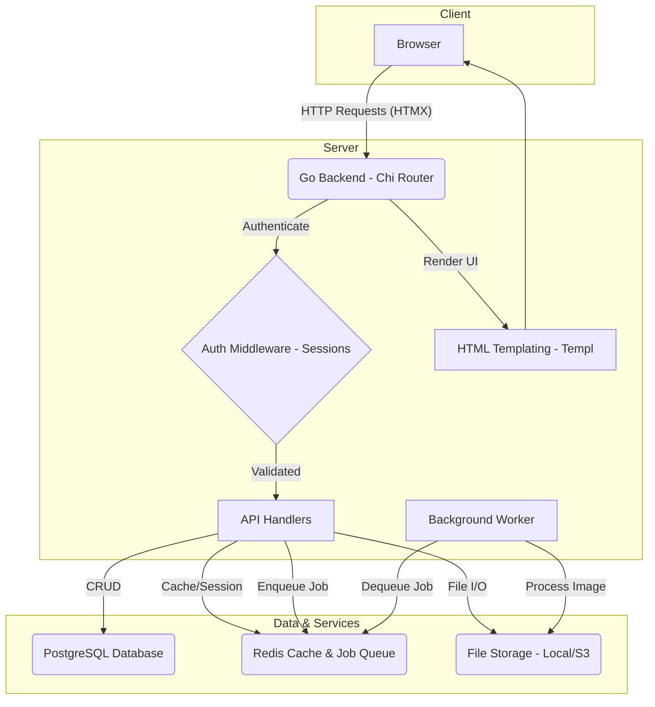

# fileShare: A Modern, Full-Stack File Management System

fileShare is a full-stack file management system built with Go, featuring secure authentication, file uploads, permissions control, and server-side rendered HTML.

The primary goal is to demonstrate proficiency in building production-ready web applications with Go, incorporating best practices in software architecture, concurrency, and maintainability.

-----

## \#\# ✨ Features:
  * **Chunked File Uploads & Resumability**: Large files are broken into smaller chunks, allowing for reliable uploads over unstable connections and the ability to resume interrupted uploads.
  * **Real-time Progress**: The frontend provides real-time feedback on upload progress and thumbnail generation without needing to refresh the page.
  * **Secure, Shareable Links**: Users can generate secure, time-sensitive links to share files with others, with options for password protection.
  * **Advanced Search & Filtering**: A powerful search functionality allows users to find files by name, type, and date, with advanced filtering options.
  * **Comprehensive API Documentation**: The API is fully documented using Swagger/OpenAPI, making it easy to understand and test.
  * **Containerized Deployment**: The entire application stack (Go, PostgreSQL, Redis) can be spun up with a single command using Docker Compose, ensuring a consistent development and deployment environment.

-----

## \#\# 🏛️ System Architecture

fileShare is designed as a monolithic application with a clear separation of concerns, making it both cohesive and maintainable. The system leverages a server-side rendering (SSR) approach with HTMX for a responsive, single-page-app feel without the complexity of a client-side JavaScript framework.

### High-Level Diagram

### Architectural Breakdown

1.  **Client**: The user interacts with a web interface built with standard HTML/CSS. The `Templ` library generates HTML on the server, and `HTMX` is used to fetch partial HTML updates, creating a dynamic user experience.
2.  **Go Backend**: A robust server built with `Go`. The `Chi` router handles incoming HTTP requests, directing them through middleware and to the appropriate handlers.
3.  **Authentication**: Private, encrypted session cookies (signed & AES-encrypted) with HTTPS-only, Secure flags.
4.  **Database**: **PostgreSQL** serves as the primary data store for user information, file metadata, and sharing permissions. It was chosen for its reliability and rich feature set.
5.  **Cache & Job Queue**: **Redis** is used for two key purposes: caching session data for faster lookups and serving as a simple message broker for background jobs like thumbnail generation.
6.  **Background Worker**: A concurrent Go routine acts as a background worker. It listens for jobs (e.g., "generate thumbnail for image X") from the Redis queue and processes them asynchronously, preventing long-running tasks from blocking the main request-response cycle.
7.  **File Storage**: Files can be stored on the local filesystem or configured to use a cloud object storage service like AWS S3 for better scalability and durability.

-----

## \#\# 🛠️ Technology Stack

This project leverages a modern, efficient, and scalable tech stack centered around Go.

| Component | Technology | Rationale |
| :--- | :--- | :--- |
| **Backend** | **Go (Golang)** with **Chi** | For its performance, concurrency model, and strong typing. Chi is a lightweight and idiomatic router. |
| **Frontend** | **Templ + HTMX + Tailwind CSS** | For creating type-safe HTML templates in Go and building dynamic interfaces without heavy JavaScript. |
| **Database** | **PostgreSQL** | A powerful, open-source relational database known for its robustness and data integrity. |
| **Caching/Queue** | **Redis** | A fast, in-memory data store perfect for session management and as a simple message queue. |
| **Testing** | **Go's built-in testing package** | For unit and integration tests to ensure code quality and reliability. |
| **Containerization** | **Docker & Docker Compose**| To create a reproducible development and production environment. |

-----
## Development Workflow

For instructions on how to get started with this application, please refer to the [Development Documentation](/development.md).

This documentation provides instructions on how to set up your environment and develop the application.

